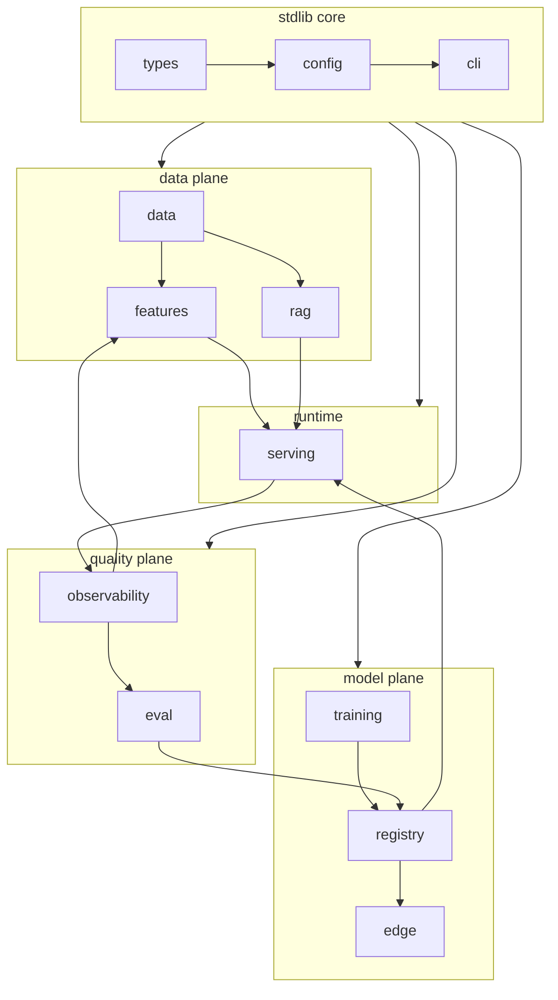

# Components: responsibilities, boundaries, contracts

The third lens divides the system into components with a responsibility each, a
boundary around it, and a contract across the boundary. In `vmp` the contract is
a `Protocol`, the boundary is a module, and the responsibility is one line in
the table below.

The rule for every module that has a swappable backend: **one `Protocol` for
that backend, one standard-library reference implementation that runs in tests
and demos, and optional adapters that import their dependency lazily inside the
class.** Where a module has no swappable backend — `data` and `training`, whose
work is a pure transformation of files plus a call into a named third-party
trainer — there is no protocol, and the table below says so rather than
inventing one. `import vmp` succeeds with nothing but the standard library
installed. Every heavy operation accepts `dry_run=True` and returns its plan as
a dict.

## Module map

## Module table

| Module | Responsibility | Protocol(s) | Reference implementation | Adapters (lazy import) |
|---|---|---|---|---|
| `types` | Shared dataclasses; stages as `str` constants | — | — | — |
| `config` | `load_config(path)`, `Settings`, `VMP_*` env overrides | — | `tomllib` | — |
| `cli` | `vmp` entry point; each module registers `vmp <module> <cmd>` | — | `argparse` | — |
| `data` | Turn corpora, preference pairs, synthetic golden set, JSONL IO, splits, PII scrub | — | `PreferencePairBuilder`; regex `scrub` | `datasets` (for `to_hf_dataset`) |
| `features` | `FeatureView`, offline and online stores, point-in-time join, materialize, Feast export | `OfflineStore`, `OnlineStore`, `EventSource` | `JsonlOfflineStore`; `InMemoryOnlineStore`; `JsonlSource` | `feast`, `redis`, `pyarrow` |
| `training` | `TrainingPlan`, LoRA config, SFT and DPO wrappers, Ray Train launcher, Ray Data preprocessing, adapter merge, dry-run planner | — | dry-run planner (scans data, estimates steps) | `torch`, `transformers`, `peft`, `trl`, `ray` |
| `registry` | `ModelArtifact` versions, stages, lineage | `Registry` | `FileRegistry` | `mlflow` |
| `rag` | Chunking, embedding, vector store, graph store, extraction, hybrid retriever with relevance floor, context packing | `Embedder`, `VectorStore`, `GraphStore` | `HashingEmbedder`; `InMemoryVectorStore`; `InMemoryGraphStore` | `sentence-transformers`, `psycopg` (pgvector), `qdrant-client`, `neo4j` |
| `serving` | `Session`/`Turn` loop, segmenter, FastAPI app, WebSocket stream, Ray Serve graph, vLLM adapter | `STT`, `LLM`, `TTS`, `Retriever` | `EchoSTT`, `TemplateLLM`, `SilentTTS`, `NullRetriever` | `fastapi`, `uvicorn`, `ray[serve]`, `vllm`, `faster-whisper`, `kokoro` |
| `edge` | Export pipeline, quantisation config, `EdgeBundle`, edge runtime, bundle verification | `CloudFallback` | `ExportPlan` + `export()`; checksum verifier | `onnx`, `onnxruntime`, `optimum`, `mlx`, `llama-cpp-python` |
| `eval` | Golden set, WER/CER, exact match, win-rate, latency percentiles, LLM judge, release gates | `Judge`, `STTLike`, `TTSLike` | pure-Python WER; `ExactMatchJudge`, `RubricJudge`; `IdentitySTT`, `StubTTS` | `jiwer` |
| `observability` | Stage tracer, metrics registry, OTel exporter, drift detectors, SLO definitions | `Sink` | `ListSink`, `JsonlSink`; `MetricsRegistry` | `opentelemetry-*`, `prometheus-client` |

## The serving runtime

The runtime owns four protocols and one algorithm.

- `STT`: audio -> transcript. Reference: `EchoSTT`. Adapters:
  `FasterWhisperSTT` (CTranslate2, CPU or CUDA).
- `LLM`: messages -> token stream. Reference: `TemplateLLM`, which emits a
  fixed reply token by token. Adapters: `OpenAICompatLLM` (a vLLM or
  OpenAI-compatible server), `OllamaLLM`, `VLLMEngineLLM` (in-process engine).
- `TTS`: sentence -> audio. Reference: `SilentTTS`, a silent WAV of the
  expected duration at 24 kHz. Adapter: `KokoroTTS`.
- `Retriever`: query -> chunks plus a context pack. Reference:
  `NullRetriever`, which returns nothing. The real one is `HybridRetriever` in
  `vmp.rag`.
- The **sentence segmenter**: token stream -> sentences, emitting only when a
  sentence is provably complete. It is the component the streaming design
  depends on, it has its own tests, and it is shared unchanged by the edge
  runtime.

`backends_from_config` builds the three model backends from the
`[serving.backends]` table, so a model swap changes one TOML entry and no code.

The `Turn` loop is `listen -> stt -> retrieve -> llm -> segment.emit -> tts ->
playback`, wrapped in a `turn` span, with each stage traced. `listen` and `stt`
run only on the audio path; a text turn starts at `retrieve`.

## Where vLLM sits

vLLM is an `LLM` adapter, nothing more. The runtime speaks to it over the
OpenAI-compatible streaming endpoint, so time-to-first-token (`llm.ttft_ms`) is
measured the same way as with the stub. What vLLM brings is continuous batching
and a paged KV cache, which is what keeps `ttft_ms` flat as concurrent sessions
rise. In the Ray Serve deployment graph, vLLM is one deployment behind the
runtime deployment, scaled on the number of in-flight requests. A LoRA adapter
produced by training is served either merged into the base weights
(`vmp.training.merge.merge_adapter`, a Python call — there is no `vmp train
merge` subcommand) or, with vLLM's multi-LoRA support, loaded by name so that
several adapters share one base model.

## Ray's three roles

Ray appears in three places, and each is a separate extra so that none is
required for the others.

| Role | Module | What it does | Runs as |
|---|---|---|---|
| **Ray Data** | `RayDataPreprocessor` in `vmp.training.ray_jobs` | Maps one row transform over a JSONL corpus, with `ray.data` or in pure Python | Part of a `RayJob` |
| **Ray Train** | `RayTrainLauncher` in `vmp.training.ray_jobs` | Wraps the same runner function (SFT, DPO or Whisper) in a `TorchTrainer` with N workers and G GPUs each | `RayJob` on KubeRay |
| **Ray Serve** | `vmp.serving` deployment graph | Runtime, STT, TTS and vLLM as deployments with independent autoscaling | `RayService` on KubeRay |

The key design point is **one `TrainingPlan`, two backends**. `compute.backend`
is `local` or `ray`; the plan is identical, and the Ray launcher only wraps the
local runner in a `TorchTrainer`. A dry run with `backend = "ray"` returns the
usual training manifest with an added `ray` block — the whole
`ray.train.torch.TorchTrainer(...)` call as serialisable data, not a `RayJob`
manifest. See [Ray](../guides/ray.md).

## TRL: SFT vs DPO

Both are plain functions over the same `TrainingPlan` — `run_sft` and `run_dpo`,
each taking `dry_run` — differing in `kind` and in what the dataset rows
contain.

- **SFT** (`SFTTrainer`): rows are `{"messages": [...]}`, `{"prompt",
  "response"}` or `{"user", "assistant"}`, all normalised to chat messages by
  `format_chat_example`, which also strips Markdown from assistant turns and
  prepends a spoken-style system prompt. Used to teach a chat model the spoken
  register in the first place, and to teach Whisper (as `whisper-lora`, a
  `SEQ_2_SEQ_LM` task) an accent.
- **DPO** (`DPOTrainer`): rows are `PreferencePair` (`prompt, chosen, rejected`).
  The model learns to prefer `chosen` over `rejected` relative to a frozen
  reference model, with `beta` controlling how far it may move. When the policy
  is a PEFT model, TRL can use the adapter-disabled base as the reference,
  which halves the memory of holding two models. Used after SFT to push the
  model toward replies that sound right when spoken.

## PEFT and LoRA

Every fine-tune in the platform is a LoRA adapter, never a full-weight update.
`LoraConfig` in `vmp.training` mirrors `peft.LoraConfig` without importing it:
rank `r`, `alpha`, `dropout`, `target_modules`, `task_type`. The adapter is a
small file with a `config_hash` and `data_hash`; the base model is referenced by
name. This is what makes the registry cheap, the edge export tractable (merge,
then convert), and the rollback trivial (point at the previous adapter).

The adapter must be **merged** before export to GGUF, ONNX or MLX, because those
runtimes load a single weight set. `vmp.training.merge.merge_adapter(base,
adapter_path, out)` does this: `dry_run=True` (the default) reads the adapter's
`adapter_config.json` and reports the plan without importing `peft`, and
`dry_run=False` calls `merge_and_unload()` and writes the merged weights. It is
the first step of `vmp edge export`. Recording the result as a `ModelArtifact`
whose lineage points at both the base and the adapter is a separate call,
`Registry.register`; the registry CLI itself only lists, shows and promotes.

## Contracts summarised

| Boundary | Input | Output | Invariant |
|---|---|---|---|
| Runtime -> STT | audio (16 kHz mono PCM) | transcript string | STT never sees session state |
| Runtime -> Retriever | query string | list of packed chunks | nothing below the relevance floor |
| Runtime -> LLM | messages | token stream | first token stamps `ttft_ms` |
| LLM -> Segmenter | token stream | sentence stream | never a truncated sentence |
| Runtime -> TTS | one sentence | a WAV byte string at the backend's `sample_rate` (24 kHz by default) | one worker thread owns the queue for a turn |
| Training -> Registry | plan, adapter, metrics | `ModelArtifact` | hashes present |
| Eval -> Registry | `GateDecision` | promotion or not | no promotion without a decision |
| Registry -> Edge | merged artifact | `EdgeBundle` | checksums verified before load |
