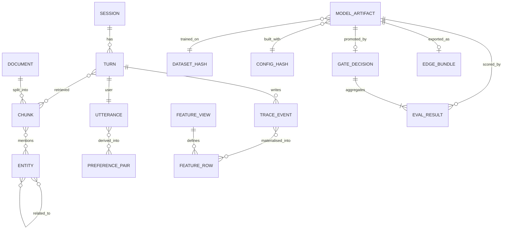

# Data: what exists, where it lives, how it is managed

The second lens asks what data the system holds and how it moves. A voice
platform has more kinds of data than a text one: audio, transcripts, traces,
preference pairs, features, documents, embeddings, graph edges, and model
artifacts. This page lists each kind, its owner module, its store, and the
lineage that ties them together.

## Inventory

| Data | Shape (`vmp.types`) | Owner | Store | Notes |
|---|---|---|---|---|
| Turn corpus | `Utterance` | `vmp.data` | JSONL | Text, optional `audio_path`, speaker, duration, `meta`. Source tag (`kokoro`, `human`) lives in `meta`. |
| Golden set | `Utterance` | `vmp.data` (builder), `vmp.eval` (scorer) | JSONL + audio directory | Hand-written text, synthesised audio, so the reference transcript is exact. |
| Preference pairs | `PreferencePair` | `vmp.data` | JSONL | `prompt`, `chosen`, `rejected`, `source`. Rule-derived from spoken-style rubrics. |
| Feature rows | `FeatureRow` | `vmp.features` | Offline: Parquet/JSONL. Online: in-memory / Redis | `entity_id`, `event_ts`, `values`. Point-in-time join keys off `event_ts`. |
| Documents, chunks | `Document`, `Chunk` | `vmp.rag` | Vector store (in-memory / pgvector / Qdrant) | `Document.sha` detects re-indexing; `Chunk` carries line span and embedding. |
| Entities, relations | dict edges | `vmp.rag` | Graph store (in-memory / Neo4j) | Extracted from chunks; expansion for multi-hop questions. |
| Trace events | JSONL rows | `vmp.observability` | Trace file, OTel exporter | `ts, session, turn, event, span, seq, ms, payload`. |
| Sessions, turns | `Session`, `Turn` | `vmp.serving` | In-memory per replica; trace is the durable record | `Turn.stages` holds stage -> ms. |
| Model artifacts | `ModelArtifact` | `vmp.registry` | Local file backend / MLflow | `data_hash`, `config_hash`, `git_sha`, `metrics`, `stage`. |
| Eval results, gates | `EvalResult`, `GateDecision` | `vmp.eval` | Stored beside the artifact in the registry | The gate decision is part of lineage. |
| Edge bundle | manifest + checksums + policy | `vmp.edge` | Bundle directory, OTA channel | Verified before load. |

## Entity relationships

## Corpora

Turn corpora are JSONL files of `Utterance`. `vmp data synth` writes a synthetic
golden text set by category (short factual, numeric, names, instruction format,
tool intent, refusal, and so on); `vmp eval golden` later synthesises the audio
and scores WER against the exact reference text.

Two rules carried from the predecessor's golden set apply here:

- **Reference text is written as ASR outputs it.** `$107`, not "one hundred and
  seven dollars". Whisper applies inverse text normalisation and returns
  digits; a reference in spoken form scores a perfect transcription as wrong.
- **Synthetic and human rows never mix silently.** `meta.source` is `kokoro` or
  `human`, and a reported number says which. Synthetic speaker diversity is not
  a substitute for real accent, noise and disfluency; the predecessor's
  speaker-variance stratum scored 0.0% WER across 28 synthetic voices, which is
  a finding about the method, not about robustness (alpha-core, cycle 5,
  2026-09-12, `evals/golden/README.md`).

A third rule comes from the accent-adaptation spike: **labels must be clean.**
Historical transcripts are the STT model's own uncorrected output, so known
mishearings are baked into the label; fine-tuning on them reinforces the error.
The corpus builder therefore takes known text read aloud, not transcripts.

## Preference pairs

`PreferencePair` rows are built by `vmp data pairs` from a JSONL file of
candidate replies. The rules encode what "sounds right when spoken" means:
shorter over longer for the same content, no Markdown or bullet syntax, no
code blocks, numbers spoken in a sayable form, one question at a time. `source`
records which rule produced the pair so that a DPO run can be sliced by rule.
See [DPO training](../guides/training-dpo.md).

## Feature store

`vmp.features` defines `FeatureView`s over entity keys (`session_id`,
`speaker_id`, `device_id`) with an `event_ts`. Two stores:

- **Offline** (Parquet or JSONL): the full history, used for training joins.
- **Online** (in-memory or Redis): the latest value per entity, used by the
  runtime at turn time.

The **point-in-time join** is the contract between them. Given a set of label
rows with timestamps, it attaches the feature values that were true *at that
time*, never a later value. Without it, a model trained on features that leaked
from the future looks better offline than it is online. `materialize` moves a
time window from offline to online; the Feast export writes equivalent
`FeatureView` definitions for a Feast repository. Streaming updates come from
trace events: a `turn.end` row carries the stage timings that become
`last_ttfa_ms`, `turns_in_session`, `avg_wer_estimate` and similar features.
See [Feature store](../guides/feature-store.md).

## Vector store and graph store

Documents are chunked by line span, embedded, and stored with their `Document.sha`
so an unchanged file is not re-embedded. The default embedder is a deterministic
hashing embedder that needs no model; it exists so that tests and demos run with
nothing installed, not as a retrieval-quality baseline. Adapters exist for
sentence-transformers, pgvector and Qdrant.

The graph store holds entities and relations extracted from chunks. It answers
the question a vector store cannot: "what is connected to this term", which is
what a multi-hop spoken question needs. Retrieval is hybrid: keyword prefilter,
vector top-k, graph expansion of the top hits, a **relevance floor** that drops
everything below a score, and context packing that fits what remains into a
prose block a spoken answer can use. See [RAG](../guides/rag-vector-graph.md).

## Telemetry events

The trace is the one data source every stage writes. Each row is
`{ts, session, turn, event, span, seq, ms, payload}`; `event` is `<stage>.start`
or `<stage>.end`. From it the platform derives:

- latency percentiles per stage (`vmp eval latency`);
- the time-to-first-audio SLO (`playback.response_ms` on `seq=1`);
- online features (streaming materialisation);
- drift inputs (WER estimates, stage timings, feature distributions).

The trace is append-only and is the durable record of a session. Sessions and
turns in the runtime are in-memory per replica; if a replica dies, the trace is
what survives.

## Registry and lineage

A `ModelArtifact` records `base_model`, `adapter_path`, `config_hash` (canonical
hash of the `TrainingPlan`), `data_hash` (hash of the training JSONL), `git_sha`,
`metrics`, and `stage`. Stages are `candidate -> staging -> production -> retired`.
Promotion requires a `GateDecision` stored beside the artifact, so the question
"why is this model in production" always has an answer: which data, which
config, which commit, which evaluation.

## Retention and privacy

Audio is the most sensitive data the platform holds. `vmp.data` has a PII scrub
step for transcripts (names, numbers, addresses, by pattern). Raw audio is kept
only as long as the retention policy says and is never written to the trace;
the trace holds durations and timings, not content. The edge runtime's offline
policy forbids network egress of audio by default. The retention runbook
(`runbooks/data-retention-and-privacy.md`) is the operational side of this.
