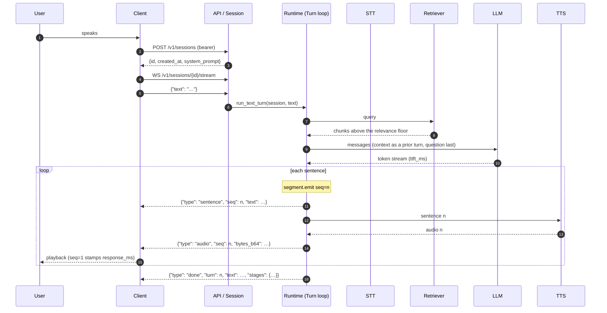

# Full stack: the path of one voice turn

The first lens asks how a request travels end to end. For a voice agent the
spine is:

**User -> Client -> API/Session -> Application Runtime -> AI Services ->
Infrastructure -> User**

Each hop is a boundary with a contract. This page walks the hops, then the
stages of a turn inside the runtime, then shows where streaming changes the
number the user feels.

## The seven hops

| Hop | Owner in this repository | Contract across the boundary |
|---|---|---|
| **User** | — | Speaks; hears the reply. Perceives one number: time to first audio. |
| **Client** | Browser, app, or edge device; `examples/` and the WebSocket client in [API](../api.md) | Captures 16 kHz mono PCM; plays the WAV bodies the server sends; holds the bearer token. |
| **API / Session** | `vmp.serving` FastAPI app | Bearer auth; `POST /v1/sessions` returns `{id, created_at, system_prompt}`; `POST /v1/sessions/{id}/turns` takes JSON text or a multipart WAV and returns the finished turn; `WS /v1/sessions/{id}/stream` takes `{"text": ...}` and streams the reply back. |
| **Application Runtime** | `vmp.serving` `Session` / `Turn` loop | Orchestrates the turn: decides when a turn starts and ends, what to retrieve, when to emit a sentence. Depends on `STT`, `LLM`, `TTS`, `Retriever` protocols, never on a vendor. |
| **AI Services** | Adapters: faster-whisper / mlx-whisper, vLLM / Ollama, Kokoro, `vmp.rag` | Each has one responsibility. STT transcribes. It does not decide what to retrieve or how to answer. |
| **Infrastructure** | `deploy/`: Kubernetes, KubeRay, Redis/Feast, pgvector/Qdrant, Neo4j, OTel, Prometheus | Compute, storage, operations. Same three buckets on a laptop and on a cluster; only the adapters change. |
| **User** | — | The first audio sample reaches the speaker. `playback.response_ms` is stamped. |

The runtime is the conductor. It does not perform transcription, inference,
retrieval or synthesis; it sequences them, owns the session state, and writes
the trace. Swapping a model changes an adapter and a config entry, never the
runtime.

## The stages of a turn

Inside the runtime a turn passes through up to eight traced stages, named in
`vmp.types.TURN_STAGES`. Every stage writes `<stage>.start` and `<stage>.end`
rows with `session`, `turn`, `span`, `seq`, `ms` and a payload.

| Stage | What happens | Payload the runtime actually writes |
|---|---|---|
| `listen` | Calls the configured listener for audio | none; `ms` is the wait |
| `stt` | Audio -> transcript | `chars` of the transcript |
| `retrieve` | Hybrid vector + graph retrieval with a relevance floor | `n_chunks`, `context_chars` |
| `llm` | Streams tokens | `ttft_ms` — the floor on everything downstream — plus `tokens`, `sentences` |
| `segment.emit` | Cuts a sentence the moment it is provably complete | `chars`, `since_llm_ms` (and `seq` on the row) |
| `tts` | Synthesises one sentence | `chars`, `audio_ms` (and `seq` on the row) |
| `playback` | Hands one sentence's audio to the client or the player | `response_ms`, on the first sentence only |
| `turn` | Wraps the whole thing | the rounded `stages` map for the turn |

Two of those are conditional. `listen` is written only when `run_turn` is
called with no audio and a `listener` is configured; `stt` only on the audio
path. A turn driven by text — which is what the WebSocket and the JSON form of
`POST /turns` do — starts at `retrieve`.

An exception inside any span stamps `payload.error` with the exception type and
message and re-raises, so a failed turn is a row in the trace rather than a gap
in it. There is no `outcome` field.

`tts` and `playback` run once per sentence, so `seq` joins a sentence across
`segment.emit seq=3 -> tts seq=3 -> playback seq=3`. `vmp obs summarise`
accumulates repeats into count, total, first and max rather than overwriting
them, so the first sentence's cost stays visible next to the mean.

## Sequence diagram

Steps 2 through 4 happen once per session, not per turn; steps 7 onward are
what the trace records.

The WebSocket carries text in, not audio: the `stt` stage appears when a client
posts a WAV to `POST /v1/sessions/{id}/turns` as `multipart/form-data`, and the
runtime then calls `S` before `G` in the diagram above. That endpoint waits for
the whole turn, so the caller sees the serial latency. Streaming and
speech-to-text are on two different endpoints today, and a client that needs
both runs STT itself and streams the transcript.

## Where streaming changes time-to-first-audio

The serial design synthesises the whole answer and then plays it. Time to first
audio then grows with the length of the answer: it is the sum of the LLM
generation of every sentence plus the synthesis of every sentence.

The streaming design changes *when the first sound arrives*, not how long the
whole answer takes. The LLM streams tokens; the segmenter cuts a sentence as
soon as it is complete; that sentence is synthesised and played while the model
is still writing the next one. Time to first audio is then bounded by the first
sentence: `ttft_ms` + the time to generate one sentence + the time to synthesise
it.

Measured on an eight-sentence answer with playback stubbed to run in real time:

| Path | Time to first audio |
|---|---|
| serial | 11,049 ms |
| streaming | 2,688 ms |

Source: alpha-core, cycle 5, 2026-09-12, `README.md` "Streaming". Both paths
wrote the same trace there, so `playback.response_ms` was directly comparable
between them. This repository's runtime has one turn loop and no `serial`
switch; the comparable A/B here is between its two endpoints, because
`POST /v1/sessions/{id}/turns` returns only when the turn is complete while the
WebSocket emits each sentence as it is ready. Neither has been benchmarked in
this repository, and the numbers above are the predecessor's, not this one's.

Three conditions make streaming safe rather than merely faster, and each one is
a place the platform has to watch:

1. **Synthesis must outrun playback.** Kokoro's measured real-time factor was
   0.105–0.157 (alpha-core, cycle 5, 2026-09-12, `README.md` "Streaming"), so
   after the first sentence the queue does not starve. The signal in this
   repository's trace is the `tts` span itself: its `ms` against the
   `audio_ms` in its own payload is the real-time factor for that sentence, and
   a ratio above one means synthesis is falling behind the audio it produces.
2. **The segmenter must never emit a truncated sentence.** A sentence cut at a
   decimal point or an abbreviation is spoken wrong and cannot be unspoken. The
   segmenter has a test suite for exactly this, and it is the one component
   that runs unchanged from research to edge.
3. **Playback must be gapless.** This one is *not* instrumented yet. The
   `playback` span records only its own duration and, on the first sentence,
   `response_ms`; nothing counts underruns or inter-sentence gaps, because the
   reference player is a stub and the real one lives in the client. Treat the
   absence as a known gap in the regression guard, not as evidence that
   playback is seamless.

## The floor: time to first token

Nothing downstream can start before the LLM emits its first token, so
`llm.ttft_ms` is the floor on time-to-first-audio. The levers on it are the
prompt length (retrieval context packing, history window), the model size, and
the serving engine (continuous batching and paged KV cache in vLLM). The
[Components](components.md) page describes where vLLM sits; the
[Operations](operations.md) page lists the capacity levers.

## What the client sees

The WebSocket stream carries four message types, all JSON, distinguished by
`type`:

| `type` | Fields | When |
|---|---|---|
| `sentence` | `seq`, `text` | The segmenter completed sentence `seq` |
| `audio` | `seq`, `bytes_b64`, `sample_rate`, `ms` | The WAV for sentence `seq`, base64 inside the JSON |
| `done` | `turn`, `text`, `stages` | The turn finished |
| `error` | `error` | Something failed; the socket stays open |

There is no `turn.start` and no `transcript` message — the client sent the text,
so there is nothing to transcribe back to it. Join `sentence` to `audio` on
`seq` rather than on arrival order: with fast stub backends several sentences
can be segmented before the first audio is queued. The full contract, including
the closure codes and a working Python client, is in [API](../api.md).

A client that plays `audio` messages as they arrive gets the streaming benefit;
a client that buffers until `done` gets the serial number.
