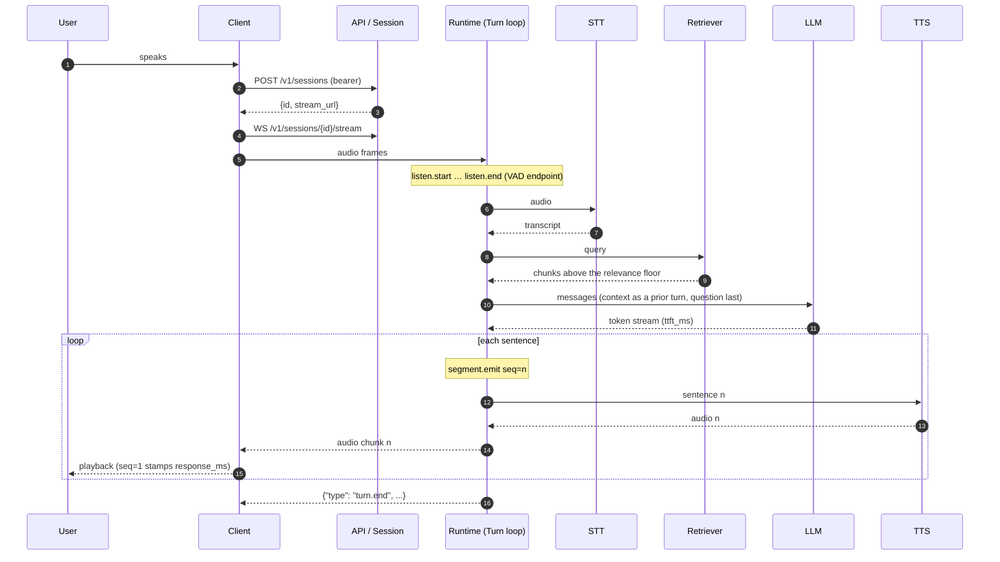

# Full stack: the path of one voice turn

The first lens asks how a request travels end to end. For a voice agent the
spine is:

**User -> Client -> API/Session -> Application Runtime -> AI Services ->
Infrastructure -> User**

Each hop is a boundary with a contract. This page walks the hops, then the
stages of a turn inside the runtime, then shows where streaming changes the
number the user feels.

## The seven hops

| Hop | Owner in this repository | Contract across the boundary |
|---|---|---|
| **User** | — | Speaks; hears the reply. Perceives one number: time to first audio. |
| **Client** | Browser, app, or edge device; `examples/` and the WebSocket client in [API](../api.md) | Captures 16 kHz mono PCM; plays 24 kHz PCM; holds the session token. |
| **API / Session** | `vmp.serving` FastAPI app | Bearer auth; `POST /v1/sessions` returns a session id and stream URL; `WS /v1/sessions/{id}/stream` carries audio in and audio out. |
| **Application Runtime** | `vmp.serving` `Session` / `Turn` loop | Orchestrates the turn: decides when a turn starts and ends, what to retrieve, when to emit a sentence. Depends on `STT`, `LLM`, `TTS`, `Retriever` protocols, never on a vendor. |
| **AI Services** | Adapters: faster-whisper / mlx-whisper, vLLM / Ollama, Kokoro, `vmp.rag` | Each has one responsibility. STT transcribes. It does not decide what to retrieve or how to answer. |
| **Infrastructure** | `deploy/`: Kubernetes, KubeRay, Redis/Feast, pgvector/Qdrant, Neo4j, OTel, Prometheus | Compute, storage, operations. Same three buckets on a laptop and on a cluster; only the adapters change. |
| **User** | — | The first audio sample reaches the speaker. `playback.response_ms` is stamped. |

The runtime is the conductor. It does not perform transcription, inference,
retrieval or synthesis; it sequences them, owns the session state, and writes
the trace. Swapping a model changes an adapter and a config entry, never the
runtime.

## The stages of a turn

Inside the runtime a turn passes through eight traced stages. Every stage writes
`<stage>.start` and `<stage>.end` rows with `session`, `turn`, `span`, `seq`,
`ms` and a payload.

| Stage | What happens | Payload worth watching |
|---|---|---|
| `listen` | Energy VAD waits for speech, ends the turn on silence | `vad_wait_ms`, `endpoint_ms`, `audio_s`, `end_reason` |
| `stt` | Audio -> transcript | `audio_s` against `ms` is the real-time factor |
| `retrieve` | Hybrid vector + graph retrieval with a relevance floor | which path fired, chunks kept, chars injected |
| `llm` | Streams tokens | `ttft_ms` — the floor on everything downstream |
| `segment.emit` | Cuts a sentence the moment it is provably complete | `seq`, `chars`, `since_ttft_ms` |
| `tts` | Synthesises one sentence | `chars`, `audio_s`, `queue_wait_ms` |
| `playback` | Plays one sentence on one long-lived stream | `response_ms` on `seq=1`; `buffered_s`; `underruns` |
| `turn` | Wraps the whole thing | `outcome` |

`tts` and `playback` run once per sentence, so `seq` joins a sentence across
`segment.emit seq=3 -> tts seq=3 -> playback seq=3`. Repeats accumulate into
count, total, first and max rather than overwriting each other.

## Sequence diagram

Steps 5 through 15 are what the trace records. Steps 2 through 4 happen once per
session, not per turn.

## Where streaming changes time-to-first-audio

The serial design synthesises the whole answer and then plays it. Time to first
audio then grows with the length of the answer: it is the sum of the LLM
generation of every sentence plus the synthesis of every sentence.

The streaming design changes *when the first sound arrives*, not how long the
whole answer takes. The LLM streams tokens; the segmenter cuts a sentence as
soon as it is complete; that sentence is synthesised and played while the model
is still writing the next one. Time to first audio is then bounded by the first
sentence: `ttft_ms` + the time to generate one sentence + the time to synthesise
it.

Measured on an eight-sentence answer with playback stubbed to run in real time:

| Path | Time to first audio |
|---|---|
| serial | 11,049 ms |
| streaming | 2,688 ms |

Source: alpha-core, cycle 5, 2026-09-12, `README.md` "Streaming". Both paths
write the same trace, so `playback.response_ms` is directly comparable between
them. This repository's runtime keeps a `serial` mode for the same A/B purpose;
it has not been benchmarked here.

Three conditions make streaming safe rather than merely faster, and each one is
a place the platform has to watch:

1. **Synthesis must outrun playback.** Kokoro's measured real-time factor was
   0.105–0.157 (alpha-core, cycle 5, 2026-09-12, `README.md` "Streaming"), so
   after the first sentence the queue does not starve. `tts.queue_wait_ms` is
   the signal if it ever does.
2. **The segmenter must never emit a truncated sentence.** A sentence cut at a
   decimal point or an abbreviation is spoken wrong and cannot be unspoken. The
   segmenter has a test suite for exactly this, and it is the one component
   that runs unchanged from research to edge.
3. **Playback must be gapless.** `playback.summary` carries `underruns` and
   `gap_ms_max`. Non-zero means the listener heard a seam; it is the regression
   guard for the streaming design.

## The floor: time to first token

Nothing downstream can start before the LLM emits its first token, so
`llm.ttft_ms` is the floor on time-to-first-audio. The levers on it are the
prompt length (retrieval context packing, history window), the model size, and
the serving engine (continuous batching and paged KV cache in vLLM). The
[Components](components.md) page describes where vLLM sits; the
[Operations](operations.md) page lists the capacity levers.

## What the client sees

The WebSocket stream carries a small vocabulary of messages, in this order for a
turn: `turn.start`, `transcript` (final), `sentence` (one per `segment.emit`),
`audio` (binary, one or more per sentence), `turn.end` with the stage timings.
The full message sequence is in [API](../api.md). A client that plays `audio`
frames as they arrive gets the streaming benefit; a client that waits for
`turn.end` gets the serial number.
