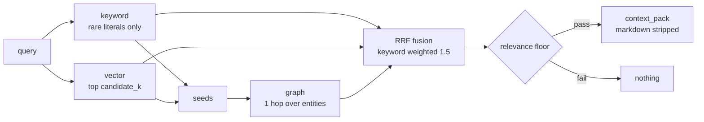

# RAG for voice: vector, graph, and the relevance floor

Retrieval-augmented generation for a text chatbot has a forgiving failure mode.
The retriever returns something mediocre, the model writes a vague paragraph, the
user skims it in two seconds and asks again.

A voice agent reads the whole thing out loud. There is no skimming. A bad
retrieval is ninety seconds of confident, irrelevant speech that the listener
cannot skip and cannot scan for the part that matters. The cost of a wrong
retrieval is an order of magnitude higher, and it is paid in real time.

<!-- more -->

## Two observations that shaped the design

**The scores barely separate.** On the predecessor's own repository corpus,
retrieval rank 1 scored **0.494** and rank 20 scored **0.442** — a spread of 0.05
(alpha-core, cycle 5, 2026-09-12, `README.md` "Talking about this codebase").

Sit with that for a moment. Across the top twenty results, the similarity signal
varies by five hundredths. Rank order within that band is close to arbitrary: it
reflects corpus composition and chunking artefacts as much as relevance. And
because a top-k always returns k results, the retriever is confidently handing
back its twentieth-best guess with the same interface it uses for its best one.

The practical consequence showed up immediately. A question about "Gate A" — a
term appearing in exactly one file — put that file at rank 5, then rank 6, then
rank 10 as *unrelated* files were added to the corpus. At the default top-k it
fell out of the window entirely, and the answer came from whatever else happened
to score nearby.

**Code echo.** Asked "how many oceans are on Earth?", a retrieval-grounded agent
replied with an unrelated Python snippet. Twice, live (alpha-core, cycle 5,
2026-09-12, `spikes/streaming-whisper-m4/README.md`). Nothing in the corpus
answered the question. The retriever returned the nearest chunks anyway, because
that is what a top-k does. The model dutifully read them out.

The fix for that is not better ranking. No amount of ranking improvement makes
the nearest chunk relevant when nothing in the corpus is. The fix is allowing the
retriever to return nothing.

## Four parts, each answering a failure



**The keyword prefilter** exists because of "Gate A". An exact match on a term
rare enough to be a literal is stronger evidence than a cosine rank, and it costs
an inverted index. The index holds unigrams *and* bigrams and keeps stopwords, so
"gate a" survives as a bigram — drop stopwords and the single most diagnostic
term in that query disappears.

"Rare" needs care. A query n-gram qualifies when its document frequency is at
most `keyword_max_df` (3) **and** at most `keyword_max_df_fraction` (0.2) of the
corpus. The fraction is what keeps the notion meaningful on a small corpus: with
eighty chunks, an absolute cut-off of three admits most of the vocabulary.
Matching chunks are scored by summed idf, bigrams weighted double.

**The vector path** takes the top `candidate_k` by cosine, discarding anything at
or below zero — a zero cosine means no shared feature at all and carries no rank
signal.

**Graph expansion** extracts entities from the query and the seed chunks, then
follows them one hop over `mentions` edges to other chunks naming the same
entity. This assembles an answer split across two sections of a document instead
of truncating at whichever section ranked higher.

**Reciprocal-rank fusion** combines the three rankings without requiring their
score scales to be comparable — `score(id) = Σ weight / (k + rank)` with
`k = 60`. The keyword path is weighted **1.5** against the vector path's 1.0.
That constant is the "Gate A" failure written down as a number.

## The relevance floor

A chunk survives only if it was a keyword hit **or** its cosine is at least
`relevance_floor` (0.15), and its fused score is at least `min_fused`. Everything
else increments `result.floored`.

When nothing survives, the result is empty and the runtime injects no context.
The model answers from its own knowledge, or says it does not know. Both are
better than reading out an unrelated file with the authority of a citation.

This is the piece most likely to be tuned away. It looks like a bug the first
time it fires — "the retriever returned nothing, that can't be right" — and the
obvious response is to lower the floor until something always comes back. Doing
that rebuilds the code-echo bug exactly. Empty is a valid answer. The runtime
handles it: `retrieve.end` carries `n_chunks: 0` and the turn proceeds normally.

## What the paths look like in practice

`vmp rag query --json` reports each hit with its fused score, the path that found
it, and its raw cosine. Two real rows from an index over this documentation:

```json
{"id": "architecture/components.md:65-84", "score": 0.0391, "path": "fused",   "cosine": 0.0803}
{"id": "index.md:1-20",                    "score": 0.0242, "path": "keyword", "cosine": -0.0274}
```

The second row is the whole argument for the hybrid design. A chunk with a
**negative** cosine, retrieved and ranked third, because it contained the
literal. A pure vector retriever would never have surfaced it; a pure keyword
retriever would have missed the first.

(That index uses the default hashing embedder — deterministic, standard library,
no model download, and genuinely weak. It is the default on purpose: during
development it makes the floor and the keyword path carry their own weight
instead of being masked by a good encoder. Swap in a real sentence encoder for a
real corpus, and re-index, because embeddings from two encoders must never share
a store.)

## Measuring the thing that degrades

`vmp rag check` reports the spread rather than asserting a threshold:

```json
{"query": "time to first audio", "n": 20,
 "rank1_cosine": 0.4872, "rank20_cosine": 0.0919, "spread": 0.3953,
 "returned_after_floor": 12, "rare_terms": []}
```

It reports rather than asserts on purpose. Any fixed threshold tracks today's
file list instead of the retriever's behaviour — that was the predecessor's own
conclusion about its `check_rag.sh`, and it holds. What to watch is the trend:
the spread collapsing toward zero means the encoder has stopped discriminating on
this corpus; `returned_after_floor` reaching zero on questions the corpus does
answer means the floor is too high. Run it in CI, store the numbers, alert on the
slope.

When an answer is wrong, running the same question through `vmp rag query --json`
separates a retrieval failure from a model failure in about four seconds. Without
that separation, every retrieval bug presents as a model bug and gets debugged in
the wrong place.

## Packing context for a speaker, not a screen

The last step is the one that is specific to voice. `context_pack` renders the
surviving chunks as plain prose: headings, emphasis, links and bullets stripped,
because a TTS engine reads `**` as noise and a bulleted list spoken aloud has no
audible structure. Each block keeps a sayable citation:

```text
From architecture/components.md, lines 65 to 84.
STT: audio -> transcript. Reference: echo …
```

Truncation happens at a word boundary and the header is always kept, so a
partially included chunk is still attributable. And the pack is bounded —
`max_context_chars = 1200` — because context is paid for twice in a voice turn:
once in prompt processing, and again in the time-to-first-token that gates
time-to-first-audio. Retrieval quality and perceived latency are trading against
each other on every single turn, and the bound is where that trade is made
explicit.

## Chunks as citations

Chunks are line ranges, not token windows: `architecture/components.md:65-84`.
That makes a chunk id something a human can open, which matters when an answer is
wrong and somebody has to find out why. Twenty lines with four lines of overlap,
so a sentence straddling a boundary is present in both neighbours.

It is coarse. Twenty lines of dense prose and twenty lines of imports are not
comparable units, and `chunks_planned` against `documents` is worth glancing at
when a new file type joins the corpus. But the property of being openable by a
person is worth more than the tidiness of uniform token counts.

## Where it runs

Every backend sits behind a `Protocol` and imports its dependency inside the
class. The in-memory stores are the reference; pgvector and Qdrant are the vector
adapters, Postgres and Neo4j the graph adapters. `PgVectorStore.schema_sql(dim)`
and `postgres_graph_schema_sql()` emit the DDL, so the schema is versioned with
the code.

The cheapest production shape is one Postgres instance holding both the vectors
and the graph edges: one database, one backup, one set of credentials. Qdrant and
Neo4j earn their dependencies when the corpus outgrows that, and not before.
