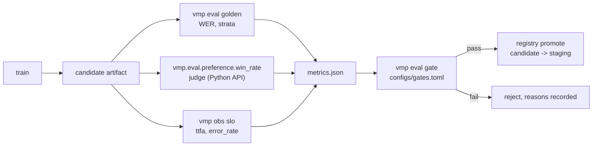

# Guide: Evaluation and gates

## Purpose

A release gate turns "this looks better" into a decision a machine can make and
a human can audit. `vmp.eval` provides the measurements — word error rate, exact
match, per-category strata, latency percentiles, judge win-rate — and the
`GateDecision` that combines them into a pass or a fail with **one reason line
per rule**, including the rules that passed.

The rule underneath all of it: **a number with no source file does not go in a
table.** Every measurement here names the file or the trace it came from, and
anything that has not been run says `not run`.

## The golden set

The trick that makes voice evaluation affordable: synthesise the audio from text
you wrote, and the reference transcript is exact by construction. Word error rate
becomes a measurement rather than an estimate, with no annotation and no dataset
licence.

```text
dataset.jsonl --(TTS, many voices)--> audio/ --(STT)--> WER, CER, exact match
```

`vmp data synth` generates the text set across nine strata:
`asr_names`, `asr_numeric`, `asr_short`, `factual_short`, `tool_intent`,
`rag_grounded`, `refusal`, `instruction_format`, `speaker_variance`. The strata
are the point. An overall WER hides everything: the predecessor's set measured
**2.69% overall** but **28.9% on `asr_names`** — gRPC heard as "JU-RPC", SQLite
as "SQ Light", OpenTelemetry as "open telemetry" (alpha-core, 2026-09-05,
`evals/golden/README.md`, 108 clips). For an assistant that will be asked about
its own stack, the stratum that matters most is ten times worse than the
headline.

The same source records two findings about the *method* that are worth carrying:

- **Write the reference the way ASR writes it.** The first version spelled
  numbers out and scored 27% WER, almost all artifact — Whisper applies inverse
  text normalisation and returns `555-0199`.
- **Synthetic speaker diversity measures nothing.** The `speaker_variance`
  stratum scored 0.0% across every voice: synthetic voices differ in timbre and
  share one clean, fluent, noise-free delivery. It is not a robustness result,
  and a real WER on real speech will be higher. This number is a **floor**.

## Config

`configs/gates.toml`:

```toml
# Release gates: every rule must pass before a candidate is promoted.

[[gate]]
metric = "wer"
max = 0.05
description = "golden-set word error rate"

[[gate]]
metric = "exact_match"
min = 0.9
description = "fraction of golden utterances transcribed exactly"

[[gate]]
metric = "ttfa_p95_ms"
max = 3000.0
required = false
description = "p95 time to first audio from a trace"

[[gate]]
metric = "win_rate"
min = 0.55
required = false
description = "judge win-rate of the candidate policy against the reference answers"

[[gate]]
metric = "error_rate"
max = 0.01
required = false
description = "fraction of turns that errored"
```

A gate needs at least one of `min` / `max`. `required = false` means a missing
metric is skipped rather than failing — which is how a gate set stays usable
while a measurement is still being built, without pretending the measurement
exists. A required metric that is missing **fails**, deliberately: silence is
not a pass.

## CLI

```bash
vmp data synth --out data/golden.jsonl --per-category 12 --seed 0
vmp eval golden --set data/golden.jsonl --out .vmp/golden --stt identity --dry-run
vmp eval golden --set data/golden.jsonl --out .vmp/golden --stt noisy --drop-rate 0.05
vmp eval wer --ref data/refs.txt --hyp data/hyps.txt
vmp eval wer --ref "set a timer for ten minutes" --hyp "set a timer for ten minute"
vmp eval gate --rules configs/gates.toml --metrics metrics.json
vmp obs slo --trace .vmp/trace.jsonl --config configs/slo.toml --wer 0.027
```

`--stt identity` returns the reference verbatim and scores a perfect run: it
tests the harness, not the model. `--stt noisy` drops words at a seeded rate,
which is how the scorer itself is regression-tested.

## What a dry run returns

`vmp eval golden --dry-run` synthesises nothing and transcribes nothing; it
reports what would run:

```json
{
  "name": "golden_asr",
  "metrics": {},
  "n": 108,
  "details": {
    "dry_run": true,
    "plan": {"stt": "IdentitySTT",
             "categories": ["asr_names", "asr_numeric", "asr_short", "factual_short",
                            "instruction_format", "rag_grounded", "refusal",
                            "speaker_variance", "tool_intent"]},
    "per_category": {}
  }
}
```

A real run returns overall `wer`, `cer` and `exact_match`, plus `per_category`
for every stratum and `items` for every clip. Real output from a 54-item
synthetic set scored with the noisy STT at a 5% drop rate:

```json
{
  "name": "golden_asr",
  "metrics": {"wer": 0.0409, "cer": 0.0372, "exact_match": 0.7778},
  "n": 54,
  "details": {
    "stt": "NoisySTT",
    "per_category": {
      "asr_names":   {"wer": 0.0,    "exact_match": 1.0, "n": 6.0},
      "asr_numeric": {"wer": 0.0536, "exact_match": 0.5, "deletions": 3.0, "n": 6.0},
      "asr_short":   {"wer": 0.0,    "exact_match": 1.0, "n": 6.0}
    }
  }
}
```

Those numbers score a synthetic error injector against synthetic text. They
exercise the scorer; they measure no model. This repository has not run a real
ASR evaluation.

## Gate output

`vmp eval gate` prints a `GateDecision` and exits 0 or 1. Every rule produces a
line, passes included — an audit trail needs to show what was checked, not only
what broke. Real output:

```json
{
  "passed": true,
  "reasons": [
    "PASS wer: 0.027 ok (<= 0.05)",
    "PASS exact_match: 0.93 ok (>= 0.9)",
    "PASS ttfa_p95_ms: 2688 ok (<= 3000)",
    "PASS win_rate: missing (optional, skipped)",
    "PASS error_rate: 0.004 ok (<= 0.01)"
  ],
  "results": []
}
```

The `--metrics` file is either a flat `{metric: value}` object or a serialised
`EvalResult`. When results are passed as objects, `collect_metrics` exposes each
metric twice — bare (`wer`) and prefixed by result name (`golden_asr.wer`) — so
a gate can target one specific evaluation when two of them report the same
metric name.

### Absolute thresholds and regression checks

`evaluate_gates` answers "is this good enough?". `no_regression` answers the
other question, "is this worse than what is in production?":

```python
from vmp.eval.gates import no_regression

decision = no_regression(candidate_metrics, production_metrics, tolerance=0.002)
# FAIL wer: baseline 0.027 -> candidate 0.031 (delta +0.004)
```

`wer`, `cer`, `error_rate`, `ttfa_p50_ms` and `ttfa_p95_ms` regress upward;
everything else regresses downward. Both checks belong in a promotion path: an
absolute gate stops a bad artifact, a regression check stops a slow slide that
never individually crosses a threshold.

## Judges and win-rate

Preference quality needs a judge, and `vmp.eval.judge` offers three behind one
`Judge` protocol:

- **`ExactMatchJudge`** — 1.0 when the normalised answer equals the reference.
  Honest and narrow.
- **`RubricJudge`** — rule checks for spoken answers: at most `max_sentences`,
  optional `max_words`, no Markdown, no URLs, non-empty, no forbidden phrases.
  The score is the fraction of rules that pass. Deterministic and free.
- **`LLMJudge`** — an LLM prompted with the rubric and a pairwise comparison.

The trap is circularity. If the preference pairs were generated by a rule and
then scored by the same rule, the win-rate measures whether the training
succeeded at fitting the rule, not whether the replies got better. The rubric
judge is a smoke test and is useless as evidence in that setup. A real judge is
an LLM, prompted with the rubric, run with the two answers in **both orders**
and both scored, and reported **with the judge named**. Judges prefer longer and
more formatted answers unless explicitly told the answer will be spoken.

## Latency from traces

Latency is not measured by a stopwatch in a notebook; it is read from the same
trace rows production writes. `vmp obs slo` computes `ttfa_p50_ms`,
`ttfa_p95_ms` and `error_rate` from `playback.end` payloads and turn outcomes,
and reports error-budget consumption against `configs/slo.toml`. See
[Observability](observability.md). The `ttfa_p95_ms` that a gate consumes is the
number that command produced.

## Where gates sit in the path



The `GateDecision` is stored in the registry beside the artifact, so the answer
to "why was this promoted?" is an object, not a memory. Promotion to
`production` is a separate, human-owned step; the gate makes it safe, it does
not make it automatic.

## What the real run needs

```bash
pip install -e ".[eval]"     # jiwer
```

WER, CER, alignment and the golden-set scorer are pure Python and need nothing.
`jiwer` is only for cross-checking against a reference implementation. Real
audio synthesis and transcription need the [serving](serving-api.md) extras
(Kokoro, faster-whisper), because the golden set uses the same backends the
runtime does — which is the point: it measures the pipeline that ships.

## Pitfalls

- **Overall WER hides the stratum that matters.** Always read `per_category`.
  A 2.69% headline with 28.9% on names is a system that mishears every proper
  noun.
- **A synthetic golden set is a floor, not a result.** No microphone, no noise,
  no disfluency, no real accents. Promote real recorded failures into the set as
  they occur and let the synthetic rows age out of the strata they stand in for.
  Never mix `source: kokoro` and `source: human` rows in a reported number
  without saying so.
- **A round trip conflates two stages.** TTS saying it badly and STT hearing it
  badly produce the same WER. A regression says "the pipeline got worse", not
  which half.
- **`required = false` is a promise, not a shrug.** It marks a metric that is
  being built. Review the optional list every cycle; a gate permanently optional
  is a gate that does not exist.
- **Do not tune the threshold to the candidate.** If the gate fails and the
  response is to raise `max`, the gate has become a formality. Change it
  deliberately, in its own commit, with the reason written down.
- **Gate the artifact that ships.** Quantise first, then evaluate. See
  [Edge export](edge-export.md) — a 23× latency win that answers 2 of 6 factual
  questions wrong is exactly what a correctness gate is for (alpha-core, cycle
  5, 2026-09-12, `notebook_optimized.ipynb`).
