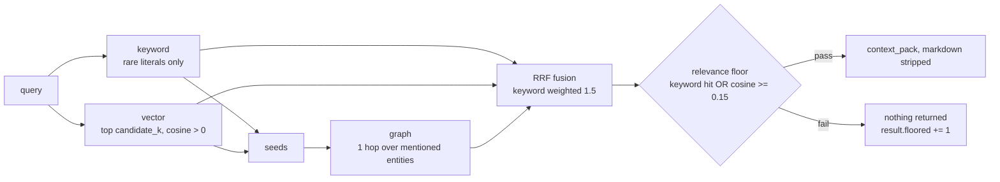

# Guide: RAG, vector and graph

## Purpose

Retrieval grounds an answer in a corpus so the model quotes instead of invents.
For a voice agent it has two extra constraints that a text chatbot does not
have: the retrieved text is going to be **spoken**, so it must be prose rather
than Markdown, and a wrong retrieval is **read aloud in full** before anyone can
skim past it.

`vmp.rag` is a hybrid retriever: a keyword prefilter over rare literals, a
vector top-k, a one-hop graph expansion, all fused with reciprocal-rank fusion
and gated by a **relevance floor** that returns nothing when nothing is
relevant.

Each of those four parts exists because of an observed failure, not because it
is standard.

## The three failures this design answers

**Cosine ranking barely separates.** On the predecessor's own repository corpus,
rank 1 scored **0.494** and rank 20 scored **0.442** — a spread of 0.05
(alpha-core, cycle 5, 2026-09-12, `README.md` "Talking about this codebase").
With a spread that small, rank order is close to arbitrary, and a top-k always
returns *something*.

**A rare literal was ranked out of the window.** A question about "Gate A", a
term that appears in exactly one file, placed that file at rank 5, then 6, then
10 as unrelated files were added to the corpus. At the default `top_k` it was
missed entirely, and the answer came from whatever else scored nearby. An exact
match on a term rare enough to be a literal is stronger evidence than a cosine
rank, and it costs an inverted index.

**Code echo.** Asked "how many oceans are on Earth?", a retrieval-grounded agent
replied with an unrelated Python snippet (alpha-core, cycle 5, 2026-09-12,
`spikes/streaming-whisper-m4/README.md`, third notebook). Nothing in the corpus
answered the question, the retriever returned the nearest chunks anyway, and the
model read them out. The fix is not better ranking. It is the retriever being
allowed to say nothing.

## Config

`configs/rag.toml`:

```toml
# Retrieval configuration. Loaded with `tomllib`; keys map to `Index.from_config`.

[rag.corpus]
include = ["**/*.md", "**/*.txt", "**/*.py", "**/*.toml"]

[rag.chunk]
lines = 20      # lines per chunk
overlap = 4     # lines shared between neighbouring chunks

[rag.embedder]
kind = "hashing"   # "hashing" is stdlib only; adapters are wired in code
dim = 512

[rag.retrieval]
top_k = 5
candidate_k = 20        # per-path candidate pool before fusion
relevance_floor = 0.15  # min cosine unless a rare-literal keyword hit
min_fused = 0.0         # min RRF score; 0 disables
graph_hops = 1
keyword_max_df = 3            # a query n-gram is "rare" if it occurs in <= this many chunks
keyword_max_df_fraction = 0.2 # and in <= this fraction of all chunks (matters on small corpora)
```

Chunks are line ranges, not token windows, so a chunk id (`path:start-end`) is
a citation a human can open. `overlap` keeps a sentence that straddles a
boundary present in both neighbours.

The default embedder is a **deterministic hashing embedder**: standard library,
no model download, reproducible across machines. It is genuinely weak, and that
is deliberate — it makes the floor and the keyword path carry their own weight
during development instead of being masked by a good encoder. Swap in
`sentence-transformers` for real corpora.

## How retrieval runs



**Keyword prefilter.** The index holds unigrams *and* bigrams, and keeps
stopwords, so "gate a" survives as a bigram. A query n-gram counts as rare when
its document frequency is at most `keyword_max_df` **and** at most
`keyword_max_df_fraction` of the corpus — the fraction is what keeps "rare"
meaningful on a corpus of eighty chunks, where an absolute cut-off of 3 would
admit most of the vocabulary. Matching chunks are scored by summed idf, with
bigrams weighted double.

**Vector path.** Top `candidate_k` by cosine, discarding anything at or below
zero: a zero cosine means no shared feature at all and carries no rank signal.

**Graph expansion.** Entities are extracted from the query and from the seed
chunks, then followed one hop over `mentions` edges to other chunks that name
the same entity. This is what assembles an answer split across two sections of
a document instead of truncating at the first one.

**Fusion.** Reciprocal-rank fusion, `score(id) = Σ weight / (k + rank)` with
`k = 60`, combines the three rankings without needing their score scales to be
comparable. The keyword path is weighted **1.5** against the vector path's 1.0,
which is the "Gate A" failure encoded as a constant.

**The floor.** A chunk survives only if it was a keyword hit **or** its cosine
is at least `relevance_floor`, and its fused score is at least `min_fused`.
Everything else increments `result.floored`. When nothing survives, the result
is empty and the runtime injects no context at all — the model answers from its
own knowledge or says it does not know, which is a better failure than reading
out an unrelated file.

## Packing context for speech

`RetrievalResult.context_pack(max_chars)` renders the surviving chunks as plain
prose. `strip_markdown` removes headings, emphasis, links and bullets, because
a TTS engine reads `**` and `##` as noise or silence, and a bulleted list spoken
aloud has no audible structure. Each block is prefixed with a sayable citation:

```text
From architecture/components.md, lines 65 to 84.
STT: audio -> transcript. Reference: echo (returns the text the demo put in
Utterance.text). Adapters: faster-whisper (CTranslate2, CPU or CUDA),
mlx-whisper (Apple GPU).
```

Truncation happens at a word boundary, never mid-word, and the header is always
kept so a partially-included chunk is still attributable. The serving runtime
bounds the pack with `serving.max_context_chars` (1200 by default) — context
length is paid for twice in a voice turn, once in prompt processing and again in
time-to-first-token, which is the floor on time-to-first-audio.

## CLI

```bash
vmp rag --config configs/rag.toml index docs/ --dry-run   # plan: added/changed/removed
vmp rag --config configs/rag.toml index docs/             # build and persist
vmp rag query "how does the sentence segmenter work"      # ranked chunks + the packed context
vmp rag query "how does the sentence segmenter work" --json --k 8
vmp rag check --query "time to first audio" --query "release gate" --k 20
```

`--config` and `--root` belong to the `rag` command, before the subcommand.
`--root` (or `VMP_RAG_INDEX_ROOT`) chooses the index directory; the index is
loaded if it already exists, so `index` is incremental.

## What a dry run returns

```json
{
 "corpus": "docs",
 "documents": 9,
 "plan": {"added": 9, "changed": 0, "unchanged": 0, "removed": 0},
 "chunk_lines": 20,
 "overlap": 4,
 "embedder": "HashingEmbedder",
 "dim": 512,
 "dry_run": true,
 "chunks_planned": 74
}
```

The plan is computed from `Document.sha`, so re-indexing an unchanged corpus
reports `unchanged` and does no work. A real run adds `chunks_added`,
`chunks_total`, `graph_nodes`, `graph_edges` and `saved_to`.

`vmp rag query --json` returns each hit with its fused `score`, its `path`
(`keyword`, `vector`, `graph`, or `fused` when more than one path found it), and
its raw `cosine` — which is how you tell "the keyword path saved this" from
"the encoder found it":

```json
{"id": "architecture/components.md:65-84", "score": 0.0391, "path": "fused", "cosine": 0.0803}
{"id": "index.md:1-20",                    "score": 0.0242, "path": "keyword", "cosine": -0.0274}
```

The second row is the whole argument for the hybrid design: a chunk with a
*negative* cosine, retrieved and ranked third, because it contained the literal.

## `vmp rag check`: measure the spread, do not assert a threshold

```json
{
 "k": 20,
 "chunks": 74,
 "queries": [
  {"query": "time to first audio", "n": 20,
   "rank1_cosine": 0.4872, "rank20_cosine": 0.0919, "spread": 0.3953,
   "returned_after_floor": 12, "rare_terms": []}
 ]
}
```

This is the diagnostic the predecessor's `check_rag.sh` performed, and it
reports rather than asserts on purpose: any fixed threshold tracks today's file
list instead of the retriever's behaviour. What to watch is the **spread**
collapsing toward zero (the encoder has stopped discriminating on this corpus)
and `returned_after_floor` reaching zero on questions the corpus does answer
(the floor is too high). Run it in CI and store the numbers; alert on the trend,
not on one run.

## What the real run needs

```bash
pip install -e ".[rag]"      # sentence-transformers, psycopg, qdrant-client, neo4j
```

Every backend is behind a `Protocol` and imports its dependency inside the class:

| Protocol | Reference (stdlib) | Adapters |
|---|---|---|
| `Embedder` | `HashingEmbedder` | `sentence-transformers` |
| `VectorStore` | `InMemoryVectorStore` | `PgVectorStore` (pgvector), `QdrantVectorStore` |
| `GraphStore` | `InMemoryGraphStore` | `PostgresGraphStore`, `Neo4jGraphStore` |

`PgVectorStore.schema_sql(dim)` and `postgres_graph_schema_sql()` emit the DDL,
so the schema is versioned with the code rather than kept in a wiki. Postgres
can hold both the vectors and the graph edges, which is the cheapest production
shape: one database, one backup, one set of credentials. Qdrant and Neo4j earn
their place when the corpus outgrows it.

Switching the embedder invalidates every stored embedding. Re-index; do not mix
vectors from two encoders in one store.

## Pitfalls

- **The floor is the feature.** Raising `relevance_floor` until the retriever
  always returns something rebuilds the code-echo bug. Empty is a valid answer,
  and the runtime is built to handle it — `retrieve.end` carries `n_chunks: 0`
  and the turn proceeds.
- **`keyword_max_df` alone is wrong on small corpora.** Keep the fraction. With
  74 chunks the effective limit is `min(3, 14)`; with 4,000 it is 3.
- **Chunking by lines is honest but coarse.** A 20-line chunk of dense prose
  and a 20-line chunk of imports are not comparable units. Inspect
  `chunks_planned` against `documents` when adding a new file type.
- **Graph expansion follows entities, and entity extraction is heuristic.** A
  corpus with few proper nouns gets little from the graph path; check
  `graph_nodes` and `graph_edges` after indexing before assuming it is doing
  work.
- **Markdown must be stripped before synthesis, not after.** Anything that
  reaches the TTS with `**` in it has already lost.
- **Measure retrieval separately from generation.** When an answer is wrong,
  `vmp rag query --json` on the same question tells you whether the retriever or
  the model failed. Without that, every retrieval bug looks like a model bug.
