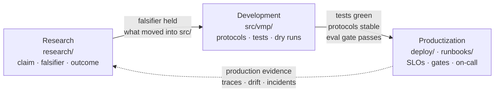
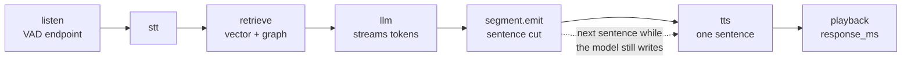

# voice-ml-platform

An ML platform for voice agents, shown as a progression from **research** to
**development** to **productization**. It generalises a fully local voice agent
(energy VAD -> Whisper STT -> local LLM -> sentence segmenter -> Kokoro TTS) into a
platform that can train, evaluate, serve, and ship models to both a **cloud API**
and an **edge device**.

The package is `vmp`. The core is standard library only: every heavy backend
(PyTorch, TRL, PEFT, Ray, vLLM, Feast, pgvector, Qdrant, Neo4j, ONNX, MLX) is an
optional adapter behind a `Protocol`, imported lazily inside the adapter class.
`import vmp` succeeds with nothing installed; every heavy operation has a
`dry_run` that validates inputs and returns a plan without importing anything.

## What is in the repository

| Path | Stage | Contents |
|---|---|---|
| `research/` | 1. Research | Hypotheses and spikes: claim, falsifier, method, outcome |
| `src/vmp/` | 2. Development | The platform package: typed, tested, protocol-driven |
| `deploy/` | 3. Productization | Docker, Kubernetes (kustomize), KubeRay, Feast, OTel, Prometheus, Grafana |
| `runbooks/` | 3. Productization | Incident, rollback, drift, on-call, capacity, retention |
| `configs/` | all | TOML configs read with `tomllib`; `VMP_*` env overrides |
| `examples/` | all | `python examples/demo_*.py`, runnable with no extras |
| `tests/` | all | `pytest`; no network, no models, no GPU in the default run |

## The progression



Each arrow is a gate with an exit criterion. [Progression](progression.md) lists
them, and the two [whitepapers](whitepapers/index.md) explain why the contracts
between stages matter more than any one component.

## The pipeline of a voice turn

Every stage writes a `<stage>.start` and `<stage>.end` trace row. The stages are
`listen, stt, retrieve, llm, segment.emit, tts, playback, turn`. The `playback`
payload carries `response_ms`, the time from the end of the user's speech to the
first sample of the reply: **time-to-first-audio**, the headline metric.



The segmenter is what makes the turn feel fast: the first sentence is synthesised
and played while the model is still writing the rest. On an eight-sentence
answer with playback stubbed to real time, streaming reached first audio in
2,688 ms against 11,049 ms for the serial path (alpha-core, cycle 5, 2026-09-12,
`README.md` "Streaming"). See [Full stack](architecture/full-stack.md).

## Quickstart

```bash
git clone https://github.com/hyperscaleailabs/voice-ml-platform
cd voice-ml-platform
python -m venv .venv && source .venv/bin/activate
pip install -e ".[dev]"

python examples/demo_voice_turn.py   # one voice turn with echo/stub backends
vmp --help                           # every subsystem registers its own subcommands
pytest                               # default run: no network, no models, no GPU
```

The demo and the tests run against the stdlib reference implementations. Real
backends are extras: `pip install -e ".[train]"`, `".[ray]"`, `".[serve]"`,
`".[rag]"`, `".[features]"`, `".[edge]"`, `".[eval]"`, `".[obs]"`. Each guide
says which extra its real run needs.

## Where to go next

- [Progression](progression.md): the three stages and their exit criteria.
- [Architecture](architecture/full-stack.md): five lenses, from the full stack
  down to production operations.
- [Guides](guides/training-lora-sft.md): one page per subsystem, each with a TOML
  config, the CLI, what a dry run returns and what the real run needs.
- [Research](research.md): the four spikes and their outcomes.
- [Blog](blog/index.md) and [Whitepapers](whitepapers/index.md): the reasoning
  behind the design.
- [API](api.md): the HTTP and WebSocket contract of the voice agent service.
- [Runbooks](runbooks.md): what to do when a gate or an SLO is breached.
- [References](references.md): the papers and the docs this design leans on.

## Evidence rule

Numbers in this documentation have a source. Measurements that come from the
private predecessor project are cited as "alpha-core, cycle 5, 2026-09-12,
`<file>`" and are never presented as this repository's benchmark. Nothing that
has not been run is reported as if it had been.
