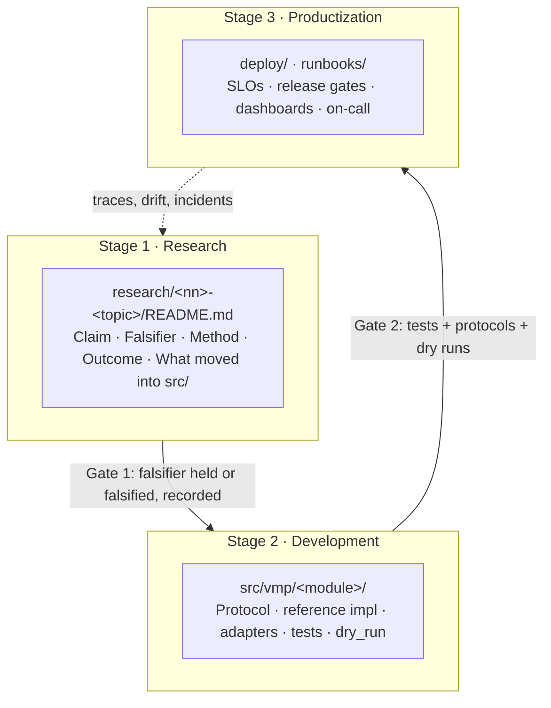

# Progression: research -> development -> productization

The repository is organised as a maturity path, not as a product. Each stage has
a directory, a form of evidence, and an exit criterion that must hold before work
moves to the next stage. The path is the same one the predecessor project walked
on a single laptop; here it is written down so that it can be repeated.

## Stage 1: Research

**Directory:** `research/`. One subdirectory per spike, `research/<nn>-<topic>/`.

**What it contains.** A README with exactly five sections: `## Claim`,
`## Falsifier`, `## Method`, `## Outcome`, `## What moved into src/`. Beside it,
whatever the spike needed: a notebook, a script, a small corpus, a results file.
The four spikes in this repository are indexed on the [Research](research.md)
page.

**Rules.**

- A spike is never imported by `src/vmp/`. It is disposable by construction.
- A spike is frozen once its outcome is recorded. If the idea survives, the
  implementation starts again from the codebase, not from the spike's diff.
- A spike ships a verification script or notebook so that someone else can
  re-run the falsifier without the author.
- The outcome is one of `not run`, `run — falsifier passes`, `run — falsified`,
  `run — inconclusive`. A spike that has not been run says so.

**Exit criterion (Gate 1).** The falsifier was executed and the result is
recorded, or the spike is explicitly marked `not run` and nothing downstream
claims its result. "What moved into src/" names the protocol or the function
that development will build, or says `nothing`.

## Stage 2: Development

**Directory:** `src/vmp/`, with `tests/`, `configs/`, `examples/`.

**What it contains.** One package per subsystem (`data`, `features`, `training`,
`registry`, `rag`, `serving`, `edge`, `eval`, `observability`). Each has:

- a `Protocol` for its backend;
- one standard-library reference implementation that runs in tests and demos;
- optional adapters that import their dependency lazily inside the class;
- a `dry_run` path on every heavy operation that validates inputs and returns the
  plan or manifest as a dict;
- a `vmp <module> <subcommand>` CLI registered through `vmp.cli.register`;
- `tests/test_<module>.py`, runnable with `pytest` alone.

**Exit criterion (Gate 2).**

- Tests pass in the default run (no network, no models, no GPU, under ~30 s).
- The protocol is stable: a second adapter can be written against it without
  changing the runtime that consumes it.
- Every heavy operation has a dry run that a CI job can execute.
- `examples/demo_<module>.py` runs with no extras installed.
- Any number in the module's docs has a source file.

## Stage 3: Productization

**Directory:** `deploy/` and `runbooks/`.

**What it contains.** Dockerfiles, Kubernetes manifests (kustomize), KubeRay
`RayJob` and `RayService` specs, Feast feature repository, OpenTelemetry
collector config, Prometheus SLO recording and alerting rules, Grafana
dashboards. The runbooks cover incident response, model rollback, drift,
time-to-first-audio SLO breach, RAG relevance degradation, edge bundle
verification failure, on-call, capacity and cost, data retention and privacy.
They are indexed on the [Runbooks](runbooks.md) page.

**Exit criterion (Gate 3, into a bounded rollout).**

- SLOs are defined as Prometheus rules with an error budget, not as prose.
- The release gate (`vmp eval gate`) passes on the candidate artifact and the
  `GateDecision` is stored in the registry beside the artifact.
- Every alert routes to a runbook, and every runbook has a rollback step.
- The rollout is bounded: canary first, with an automatic rollback trigger tied
  to the SLO.

## Maturity table

| Capability | Research | Development | Productization |
|---|---|---|---|
| Training | Notebook LoRA on one GPU; train-set metric only | `TrainingPlan`, SFT/DPO wrappers, dry-run planner, local backend | Ray Train on KubeRay, registry lineage, gate before promotion |
| Feature store | Ad-hoc dicts per session | `FeatureView`, offline/online stores, point-in-time join | Feast export, Redis online store, materialisation schedule |
| RAG | Top-k cosine over a repo, no floor | Chunking, hybrid retriever, relevance floor, graph expansion | pgvector/Qdrant + Neo4j adapters, relevance dashboards, degradation runbook |
| Serving | One process, one microphone | `Session`/`Turn` loop, FastAPI app, echo/stub backends | Ray Serve graph, vLLM adapter, autoscaling, TTFA SLO |
| Edge | Manual model conversion | Export pipeline, `EdgeBundle` manifest and checksums | OTA canary, bundle verification, offline policy |
| Evaluation | Notebook exact-match | Golden set, WER/CER, win-rate, latency percentiles, `GateDecision` | Gate in CI and in the promotion path; drift on WER |
| Observability | JSONL trace file | Stage tracer, metrics registry, drift detectors, SLO definitions | OTel export, Prometheus rules, Grafana boards, alerts to runbooks |

## What the stages share

Three things cross every boundary unchanged:

1. **The trace schema.** `ts, session, turn, event, span, seq, ms, payload`, with
   `event` as `<stage>.start` / `<stage>.end`. A research notebook, a unit test
   and a production pod write the same rows, so a latency percentile means the
   same thing at every stage.
2. **The shared types.** `Utterance`, `Turn`, `Session`, `PreferencePair`,
   `FeatureRow`, `Document`, `Chunk`, `ModelArtifact`, `EvalResult`,
   `GateDecision` are defined once in `vmp.types` and never redefined.
3. **The evidence rule.** A number with no source file does not go in a table.
   Measurements from the private predecessor are cited with their cycle, date
   and file, and are never presented as this repository's benchmark.
