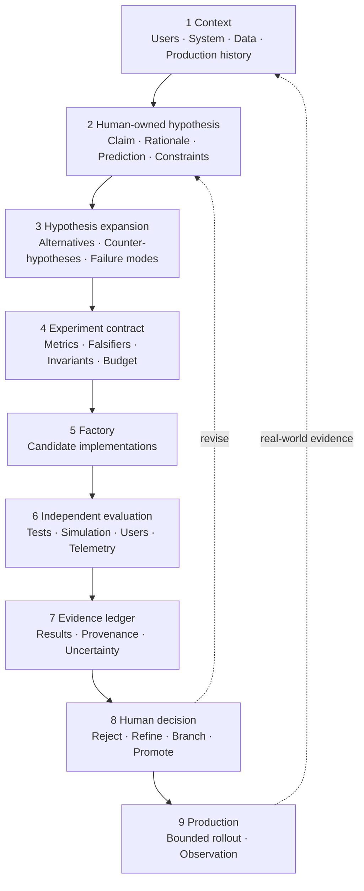

# Hypothesis-driven development for ML platforms

## Abstract

The dominant failure in applied machine learning is not a wrong result. It is a
result that was never at risk of being wrong: an experiment designed so that
whatever came out of it would be reported as a success, evaluated against a
criterion chosen after the numbers arrived.

Hypothesis-driven development (HDD) is a development cycle whose unit of work is
not a ticket but a **claim that can be falsified**. Nothing is built to be kept
until a cheap, disposable version of it has been tried and survived. This paper
describes the nine-station reference loop, the two stations a human must own, the
rules that keep a spike disposable, and how falsifiers written before a run
change what an experiment is capable of telling you.

It then addresses the question that makes the loop urgent rather than merely
tidy: when most of the cycle can be executed by autonomous agents, what must stay
human, and what must be structurally prevented? The answer developed here is
that an agent may propose, implement, test, and open a pull request, and may
never merge its own work — enforced by the harness, not by a prompt — and that an
independent second model reviews every change by re-running its checks rather
than trusting the account the implementing agent gives of itself.

The governing principle throughout: **an agent's account of its own work is
evidence about the agent, not about the work.**

---

## 1. Why hypotheses rather than tasks

### 1.1 The structure of a comfortable experiment

An ML experiment that cannot fail is easy to produce by accident. Fine-tune a
model on a corpus, evaluate on the same corpus, observe an improvement, report
it. Nothing about that procedure is dishonest, and nothing about it is
informative: the observation was guaranteed by the setup.

The accent-adaptation work in this platform's lineage is a precise example. A
LoRA adapter on Whisper's attention projections took exact match on a
35-sentence read corpus from 11/35 to 32/35 (alpha-core, cycle 5, 2026-09-12,
`notebook_whisper_accent_lora.ipynb`) — measured on the training sentences, with
no held-out set. The number is real. What it cannot distinguish is accent
adaptation from memorisation of a script.

A ticket-driven process records that as done. A hypothesis-driven process records
it as a claim whose falsifier has not been executed.

### 1.2 What a claim buys

A claim forces three decisions to be made **before** the work, when they are
still cheap and still honest:

- what would have to be observed for this to be false;
- what data and procedure would produce that observation;
- what happens to the downstream plan in each case.

The third is the one usually skipped, and it is the one that prevents a falsified
result from being quietly reframed as an inconclusive one.

---

## 2. The nine-station reference loop

Two properties do the work, and everything else is detail.

**The human owns the hypothesis and the decision.** Everything between those two
points can be delegated. Nothing outside them can.

**The loop closes.** Production is not the end of the cycle; it is the source of
the context that starts the next one.

### 2.1 Station 1 — Context

Users, system, data, and production history. The exit condition is that the
person or agent doing the work has the context it needs **and no more than it
needs**. Over-supplied context is not free: it dilutes attention and it smuggles
in conclusions.

For an ML platform, production history is the highest-value input and the one
most often absent. Traces, drift reports, incident write-ups and gate decisions
are the raw material. This is why the trace schema is identical from notebook to
pod — station 9 can only feed station 1 if its output is in a form station 1 can
read.

### 2.2 Station 2 — Hypothesis (human-owned)

A claim, a rationale, a prediction and the constraints under which it is
asserted. One falsifiable sentence, not a direction of travel.

Compare: *"improve retrieval quality"* against *"a keyword prefilter over rare
literal terms recovers the chunks that cosine ranking places outside the top-k."*
The first cannot be wrong. The second names a mechanism and a failure mode.

This station is human-owned because a hypothesis encodes what is worth knowing,
and that is a judgement about value rather than a derivation from data.

### 2.3 Station 3 — Hypothesis expansion

Alternatives, counter-hypotheses, failure modes. This is the first station that
delegates well, because it rewards breadth over judgement: what else could
explain the observation, what else could produce the wanted effect, what would
have to be true for the hypothesis to be trivially correct.

The most valuable output is the **cheap control**. In this platform's DPO spike,
expansion produced the observation that a one-line system prompt might obtain the
entire effect with no training at all — which became the first clause of the
falsifier. Controls that make the interesting work unnecessary are exactly the
ones that never get run unless they are written down early.

### 2.4 Station 4 — Experiment contract

Metrics, falsifiers, invariants, budget. The contract is written before the
factory starts and does not change afterwards.

A falsifier is a specific observation, not a threshold to be chosen later.
Compare "WER should not get much worse" against the accent spike's actual text:

> Word error rate rises on a **held-out** set of sentences by the same speaker
> that were not in the training corpus (adaptation to a speaker collapsed into
> memorisation of a script).

followed by the clause that makes it binding:

> A result on the training sentences alone cannot pass this falsifier. It can
> only fail it.

Invariants are the properties that must hold regardless of outcome: no PII in a
training corpus, no regression in the default test run, no change to a public
protocol. Budget bounds the experiment in time and compute, which is what
prevents a spike from becoming an unplanned project.

### 2.5 Station 5 — Factory

Parallel candidate implementations, each disposable. The reference loop runs
several; a smaller instance runs one.

The rule that makes this station safe is that **a spike is never imported by the
package**. The dependency runs one way: a spike may import the platform, the
platform may never import a spike. Disposability is structural rather than
intended.

### 2.6 Station 6 — Independent evaluation

Tests, simulation, users, telemetry — executed by something other than the thing
that produced the candidate.

"Independent" is load-bearing. An evaluation written by the implementer, run by
the implementer, and reported by the implementer measures the implementer's
understanding of the problem. In a platform context this means the evaluation
harness is a first-class module with its own tests, not a cell at the bottom of
the training notebook — and that the scorers run on lists of strings with no
framework dependency, so a result from any backend can be scored by the same
code.

### 2.7 Station 7 — Evidence ledger

Results, provenance, uncertainty. The ledger is where the evidence rule lives:
**a number with no source file does not go in a table.** Each entry carries what
was measured, the file that produced it, and what it does not establish.

In this platform the ledger is distributed across three durable objects: the
`ModelArtifact` with `config_hash`, `data_hash` and `git_sha`; the `GateDecision`
stored beside it with one reason line per rule including the passes; and the
trace file. Together they answer "why is this in production" without anyone
recalling anything.

### 2.8 Station 8 — Human decision (human-owned)

Reject, refine, branch, or promote. Four outcomes, not two — "refine" and
"branch" are what keep a falsified hypothesis productive rather than merely
closed.

A rejection **carries written input**. A rejection without a stated reason cannot
be routed back to a station, and an unrouted rejection becomes an opinion that
resurfaces in the next cycle unchanged.

### 2.9 Station 9 — Production

Bounded rollout and observation. Bounded means canary first, with an automatic
rollback trigger tied to an SLO. Observation means the rollout produces evidence
in the same schema the next cycle's station 1 consumes.

---

## 3. Two gates, because two decisions have different costs

The reference loop's single human decision splits in practice into two gates,
because deciding *is the idea right?* and deciding *is the implementation right?*
have different costs and different rejection paths.

| | Gate A — Experiment | Gate B — Production |
|---|---|---|
| Decides | Is the idea right? | Is the implementation right? |
| Judges | A throwaway | Refactored code, reviewed, CI-green |
| Cost of a rejection | Minutes | Hours |
| Rejection returns to | Context collection | Implementation |

Putting a human in front of a throwaway is what keeps Gate B rejections rare. The
routing asymmetry matters: a Gate A rejection returns to **context**, not to
planning, because a wrong result usually means wrong context rather than a wrong
plan. A Gate B rejection returns to **implementation**, because the behaviour is
already approved.

And the rule that makes Gate A real: **nothing reaches it that the human cannot
run.** The experiment's entire value is direct experience of it. A description is
not a substitute, and a demonstration video is not either.

---

## 4. Spike rules

Five rules, each preventing a specific way the cycle decays.

**4.1 A spike is never imported by `src/`.** Prevents the platform acquiring a
dependency on throwaway code, which is how a disposable experiment becomes
load-bearing without anyone deciding that it should.

**4.2 The throwaway is thrown away.** Stage 3 starts from the existing codebase
and the approved *behaviour*, not from the experiment's diff. An experiment too
expensive to discard was too large — which is a statement about the experiment,
not about the discipline of the person reluctant to discard it.

**4.3 A spike is frozen once its outcome is recorded.** Its directory stops
changing. A spike that keeps being edited after its gate decision is a branch
pretending to be evidence.

**4.4 A spike ships something runnable.** Someone else must be able to re-run the
falsifier without the author. This is where most of the reproducibility value
comes from, and it costs a script.

**4.5 Nothing in the spike directory runs in CI.** Spikes are not tests, are not
imported by tests, and a broken spike never fails a build. Behavioural guarantees
live in the test suite against the package. Wiring spikes into CI creates
pressure to keep them working, which defeats 4.2 and 4.3 simultaneously.

The outcome vocabulary is deliberately small: `not run`, `run — falsifier
passes`, `run — falsified`, `run — inconclusive`. Anything not run says so, and
nothing downstream may cite it.

---

## 5. What `not run` is worth

All four spikes in this repository are `not run`. It is worth being explicit
about why that is a feature of the method rather than a gap in the work.

Each of the four has a real measurement behind it from the predecessor project.
Each of those measurements has a caveat that makes it insufficient to pass the
falsifier the spike itself defines: the accent LoRA had no held-out set; the
small-model comparison had six questions and a two-item correctness difference;
the Ray claim has never met a cluster; the DPO claim has never been trained.

Recording any of them as `run — falsifier passes` because a related number exists
elsewhere would be the exact failure the format is designed to prevent. It would
also be the easiest thing in the world to do, because the numbers are good, they
are real, and they were produced by the same person.

`not run` is a status with content. It asserts that the code path executes, the
plan validates, the evaluation harness works, and the experiment is ready to be
performed by whoever has the hardware and the corpus. It asserts nothing about
the world. A platform that reports honest gaps is more useful than one that
reports confident numbers you cannot trace, because the gaps are a work queue.

---

## 6. An autonomous loop, and what it must not be allowed to do

Most of the nine stations can be executed by agents. Expansion, contract
drafting, implementation, evaluation and ledger assembly are all delegable. What
follows is an account of how that has been run in practice, and what the
structure has to guarantee.

### 6.1 Dispatch

An append-only event log drives dispatch. Agents pick up work, implement it,
commit, push, and open a pull request. In one overnight cycle this shipped four
pull requests (alpha-core, cycle 5, 2026-09-12).

### 6.2 The rule enforced by the harness, not by a prompt

**An agent may never merge its own work.** Not "is instructed not to". Cannot —
the merge capability is withheld at the tool level, outside the agent's context,
where no amount of reasoning, reinterpretation or prompt injection reaches it.

The distinction is the entire point. A prompt-level rule is a preference
expressed to a system whose job is to interpret language flexibly. A
harness-level rule is a property of the environment. Only one of those is a
control.

### 6.3 Independent review by a second model

Every pull request and every research finding is reviewed before merge by a
**different model** from the one that produced it, grounded in the repository's
own conventions.

The standing rule for that reviewer is the load-bearing sentence of this whole
section:

> An agent's account of its own work is evidence about the agent, not evidence
> about the work.

So the reviewer **re-runs the checks** rather than reading the pull request
description and agreeing with it. It does not modify the change, because a
reviewer that fixes what it finds cannot report on it — the finding disappears
into the diff and the record shows a clean review.

In cycle 5 this reviewed 4 of 4 merged pull requests (alpha-core, cycle 5,
2026-09-12).

### 6.4 The incident that demonstrates the loop working

A wake-word correction pass using Jaro-Winkler string distance fixed real accent
mishearings — 18 of 4,855 historical turns altered, 0 false positives, guarded by
a regression test that re-sweeps every historical transcript on every run
(alpha-core, cycle 5, 2026-09-12,
`spikes/streaming-whisper-m4/test_no_new_wake_words.py`).

It first shipped with a false positive: the word "no" was being corrected to the
wake word. Review caught it before it stayed live. It was reverted, fixed with
three guards, re-reviewed and re-merged the same night.

That sequence is what a functioning loop looks like from the outside. A defect
shipped, was caught by an independent check rather than by a user, and was
resolved inside the cycle that produced it. A loop that has never caught anything
has not been tested.

### 6.5 The gate that stays human regardless

Publishing. Not because agents cannot generate publishable output, but because
publishing is irreversible in a way that merging is not, and the decision is
about consequence rather than correctness.

The same principle applies at the platform boundary described in the companion
paper: `vmp eval gate` decides whether a candidate is *permitted* to be promoted;
a human decides whether it *is*. Automating the check is what makes the human
decision cheap enough to take seriously. Automating the decision removes the only
station where value judgements are made.

### 6.6 Autonomy is the mechanism, not the objective

Worth stating because it is easy to drift: the goal is not a system that runs
unattended. The goal is a system where a human's attention is spent on
hypotheses and decisions rather than on execution. Higher throughput with no
independent review is not progress; it is a faster route to an unreviewed
production change.

Throughput figures are gameable by splitting tasks smaller, and should never be
optimised alone.

---

## 7. Applying the loop to an ML platform specifically

Four properties of ML work interact with the loop in ways that ordinary software
does not.

**7.1 The falsifier usually needs a held-out set, and that is the expensive
part.** A training run is cheap relative to constructing an evaluation that could
embarrass it. Budget the contract accordingly; the corpus is the deliverable.

**7.2 The metric and the training signal must not be the same function.** If
preference pairs are derived by a rule and win-rate is scored by that rule, the
evaluation confirms that gradient descent works. This platform documents the trap
explicitly and keeps the rubric judge as a smoke test rather than as evidence.

**7.3 Measurement infrastructure must precede the experiment.** The scorers here
run on lists of strings with no framework dependency, which means the evaluation
path is usable before the training path exists. The alternative — writing the
harness immediately after the first successful run — produces a harness shaped by
the result it is about to measure.

**7.4 Coupled effects must be reported together.** A tier swap measured 192 ms
against 4,427 ms median latency, and 2 of 6 factual answers wrong against 0 of 6
(alpha-core, cycle 5, 2026-09-12, `notebook_optimized.ipynb`). Reporting the
first without the second is a selection, not a result. This platform makes the
coupling structural: the harness emits one table with latency percentiles and
accuracy as columns of the same row, and the release gate evaluates both in one
`GateDecision` so a candidate that improves one while breaching the other cannot
pass.

That last one generalises. Wherever two effects trade against each other, put
them in the same object, so that quoting one without the other requires
deliberately taking the object apart.

---

## 8. Conclusion

Hypothesis-driven development is not a heavier process than ticket-driven
development. It is the same work with three decisions moved earlier: what would
make this false, how would we see it, and what happens then.

Two stations stay human — the hypothesis and the decision — because both encode
judgements about value rather than derivations from data. Everything between them
delegates, including to autonomous agents, provided two structural guarantees
hold: an agent cannot merge its own work, enforced by the harness rather than by
instruction; and an independent second model re-runs the checks rather than
trusting the account the implementing agent gives of itself.

The rest is bookkeeping, and the bookkeeping is what makes the outcomes mean
something. A spike that says `not run` is more valuable than a spike that says
`passes` on a criterion chosen afterwards, because only one of them tells you
what to do next.

---

## References

Full annotations in [References](../references.md).

- LoRA — Hu et al., 2021, arXiv:2106.09685. See
  [Parameter-efficient fine-tuning](../references.md#parameter-efficient-fine-tuning).
- QLoRA — Dettmers et al., 2023, arXiv:2305.14314. See
  [Parameter-efficient fine-tuning](../references.md#parameter-efficient-fine-tuning).
- Direct Preference Optimization — Rafailov et al., 2023, arXiv:2305.18290. See
  [Preference optimisation](../references.md#preference-optimisation).
- TRL and PEFT documentation. See
  [Preference optimisation](../references.md#preference-optimisation) and
  [Parameter-efficient fine-tuning](../references.md#parameter-efficient-fine-tuning).
- Whisper — Radford et al., 2022, arXiv:2212.04356. See
  [Speech](../references.md#speech).
- Retrieval-Augmented Generation — Lewis et al., 2020, arXiv:2005.11401, and
  GraphRAG — Edge et al., 2024, arXiv:2404.16130. See
  [Retrieval](../references.md#retrieval).
- Ray — Moritz et al., 2018, arXiv:1712.05889, and vLLM / PagedAttention — Kwon
  et al., 2023, arXiv:2309.06180. See
  [Distributed training and serving](../references.md#distributed-training-and-serving).
- Google SRE Workbook, "Implementing SLOs". See
  [Observability and operations](../references.md#observability-and-operations).
- OpenTelemetry and Prometheus. See
  [Observability and operations](../references.md#observability-and-operations).

Companion paper:
[Research to production: an ML platform for voice agents](research-to-production-ml-platform-for-voice-agents.md).

Measurements attributed to alpha-core are from a private repository, cited by
cycle, date and file, and are not this repository's benchmarks.
